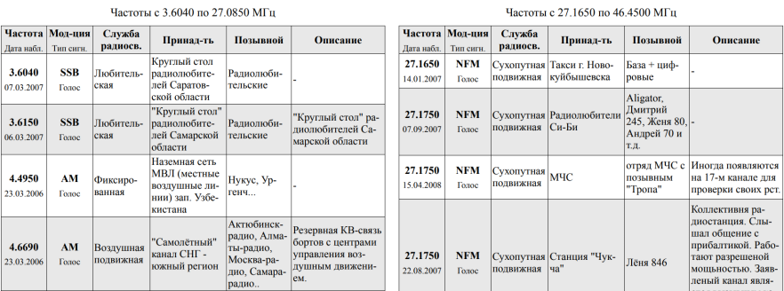

# freq_table

Мощный инструмент для создания красиво оформленных таблиц радиочастот.\
Имеется большой потенциал развития, помощь приветствуется.

Пример сгенерированной таблицы (кликабельно):

## Возможности

* Получение записей из базы портала [radioscanner.ru](http://www.radioscanner.ru/base/).
  Сайт поддерживает расширенные [поиск и фильтрацию](http://www.radioscanner.ru/base/index.php?action=search1).
* Сохранение и редактирование записей в формате YAML, объединение и обновление списков.
* Генерация HTML-файлов по шаблону, стилизация с помощью CSS.
* Простая кастомизация не требует знания HTML&CSS.

#### Недостатки:
* Остаётся необходимость (полу)ручной подгонки вёрстки.

## Использование

### Подготовка

1. Убедиться в наличии Python (протестировано на версии 3.7).
2. [Склонировать](https://help.github.com/en/articles/cloning-a-repository)
   (или просто скачать архивом и распаковать) этот репозиторий.
3. (Желательно) создать и активировать [virtual environment](https://docs.python.org/3/tutorial/venv.html).
4. Установить зависимости:

       $ pip install -r requirements.txt
      
### Конфигурирование (файл `build/config.yaml`)

1. Вписать URL нужной таблицы с сайта, (со всеми фильтрами),
   не забудьте заменить номер страницы на `{page}`.
2. Настроить содержимое и заголовки колонок по своему вкусу,
   ширину можно подобрать позже, экспериментальным путём.
3. Можно поменять также файлы `output.html.mako` и `output.css`.
   **Текущие параметры подогнаны под вертикальный лист формата A1.**

### Генерация таблицы

1. Первый запуск загрузит и сохранит записи с сайта в `build/records.yaml`:

       $ python -m freq_table -d
       
2. Можно отредактировать загруженные записи.
3. В дальнейшем можно получать обновления с сервера:

       $ python -m freq_table -sld
       
   изменённые записи при этом будут сохранены.
4. Открыть полученный `output.html` в **достаточно новом** браузере (рекомендую Chrome, Yandex).
   Открыть предпросмотр печати, выбрать параметры страницы.
   Желательно сразу выбрать экспорт в PDF.
5. Кол-во строк в каждой таблице регулируется ключом `slices` в конфиге.
   Эмпирически подобрать нужные значения.
6. После каждого изменения необходимо запускать скрипт (можно без параметров)
   и перезагружать страницу в браузере. При изменении CSS достаточно перезагрузки страницы.

## Advanced Usage

See `python -m freq_table -h`
